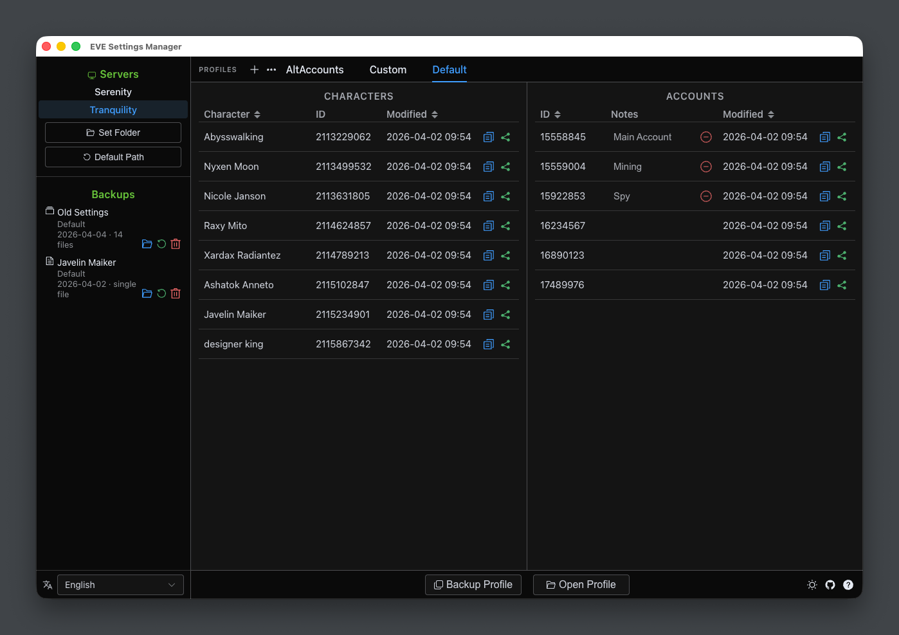

<p align="center">
  
</p>

<h1 align="center">EVE Settings Manager</h1>

<p align="center">
  A desktop app for managing your local EVE Online settings files —<br>
  copy layouts between characters, back up profiles, and keep notes on accounts,<br>
  all without touching the game client.
</p>

<p align="center">
  <a href="https://github.com/mintnick/eve-settings-manager/releases/latest"><strong>Download →</strong></a>
</p>

<p align="center">
  <a href="docs/README.zh-CN.md">简体中文</a> · <a href="docs/README.zh-CHT.md">繁體中文</a> · <a href="docs/README.ru.md">Русский</a> · <a href="docs/README.de.md">Deutsch</a> · <a href="docs/README.fr.md">Français</a> · <a href="docs/README.es.md">Español</a> · <a href="docs/README.pt-BR.md">Português (BR)</a> · <a href="docs/README.ko.md">한국어</a> · <a href="docs/README.ja.md">日本語</a> · <a href="docs/README.pl.md">Polski</a>
</p>

---



---

## Download

Go to the [Releases](https://github.com/mintnick/eve-settings-manager/releases/latest) page and download for your platform:

- **macOS** — `.dmg` — open and drag to Applications
- **Windows** — `.exe` — run directly, no installation needed
- **Linux** — `.AppImage` — make executable and run

> **macOS note:** The app is not yet code-signed. On first launch macOS may say it is "damaged and can't be opened". The most reliable fix is to run this in Terminal, then open the app normally:
> ```bash
> xattr -cr "/Applications/EVE Settings Manager.app"
> ```
> Alternatively, macOS shows an **Open Anyway** button in System Settings → Privacy & Security for about an hour after the blocked launch. If you don't see it, use the Terminal command above.

---

## Data & Privacy

Everything is stored locally — nothing is sent to any server (ESI character name lookups use the official EVE API and contain no personal data).

| Platform | Local data |
|---|---|
| macOS | `~/Library/Application Support/eve-settings-manager/` |
| Windows | `%APPDATA%\eve-settings-manager\` |
| Linux | `~/.config/eve-settings-manager/` |

---

## Uninstalling

- **macOS:** Delete the app from Applications. The data folder is not removed automatically — delete it manually if you want a clean uninstall: `~/Library/Application Support/eve-settings-manager`
- **Windows:** Delete the `.exe`. Also delete the data folder to remove everything: `%APPDATA%\eve-settings-manager`
- **Linux:** Delete the `.AppImage`. Also delete the data folder to remove everything: `~/.config/eve-settings-manager`

---

## Building from Source

**Prerequisites:** Node.js 18+, pnpm

```bash
git clone https://github.com/mintnick/eve-settings-manager.git
cd eve-settings-manager
pnpm install
pnpm dev        # dev server + Electron with hot reload
pnpm build      # type-check, bundle, and package
```

---

## Disclaimer

EVE Online and all related logos, names, and assets are property of CCP hf. This project is not affiliated with or endorsed by CCP hf.

---

## License

MIT — see [LICENSE](LICENSE)
